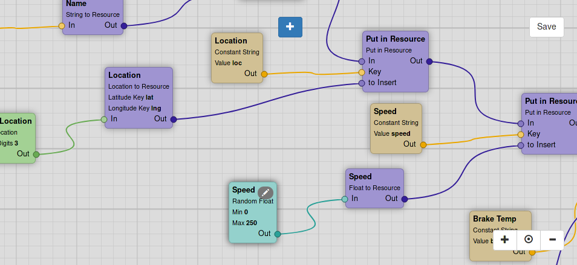

# funk

A web-based GUI for visual **func**tion composition.



## Overview

Funk was developed as a GUI for another - currently unreleased - application, called *Dataflow Engine*.
It is, however, sufficiently flexible and configurable to be used for many different use-cases.

The user of funk creates and manipulates a [DAG](https://en.wikipedia.org/wiki/Directed_acyclic_graph)
on a canvas, adding and configuring nodes of different types and connecting them with edges.

Each node-type defines the node's inputs and outputs, in particular their types.
These are color coded: edges and connectors (the point into which edges can be plugged) are displayed
in the appropriate color.
Edge-types impose a constraint on the connection between nodes, since an edge may only exist between
connectors of matching type.
 
A node-type can also define additional properties of a node.
This allows nodes to receive further static configuration, accessible through a property page.

The collection of available node- and edge-types is freely configurable.

### Usage by the *Dataflow Engine*

The *Dataflow Engine* is a cross-protocol, semantics-aware broker application.
It receives data through one or more inputs, modifies it (split, merge, filter, interpret, ...)
and sends the result through one or more outputs.
Funk is used to create the configuration that drives this behaviour.

When used this way, nodes represent operations on data and edges represent the flow between them.
Consequently, the list of available node-types reflects all operations of the *dataflow engine*
and edge-types reflect the available data types like integer, string, etc.

## Usage

(Tested on Linux)

### Installation

1. Clone the repository
1. `cd` into the project folder
1. Activate the virtual environment: `source venv/bin/activate`
(see: https://packaging.python.org/tutorials/installing-packages/#creating-virtual-environments)
1. Install dependencies: `pip install -r requirements.txt`

### Execution

1. If necessary `cd` into the project folder
1. If necessary activate the virtual environment: `source venv/bin/activate`
1. Run application: `./funk.py`
1. Open browser to: `http://localhost:5000`

### CLI Options

```
usage: funk.py [-h] [-e EXPORT]

optional arguments:
  -h, --help                    show this help message and exit
  -e EXPORT, --export EXPORT    a folder to which flows are exported upon saving
```

## Configuring funk

The edge- and node-types that the user may create are configured in `funk/static/nodetypes.json`.
This file contains a Json object with two members: `datatypes` and `nodetypes`.
(Edge-types being called datatypes is due to the application's origin as a GUI for the *dataflow engine*.)
Both contain a list of objects.

Example of an element of `datatypes`:
```
{
  "id": "integer",
  "name": "Integer",
  "color": "#153D61"
}
```
Each edge-type (`datatype`) contains a unique `id`, a human-meaningful `name` and a `color` for display in the GUI.

Example of an element of `nodetypes`:
```
{
  "type": "mean_over_time",
  "name": "Mean over Time",
  "color": "#94d1cc",
  "categories": [
    "Float"
  ],
  "connector_l": [
    {
      "id": "in",
      "name": "In",
      "type": "float",
      "direction": "in",
      "maxConnections": 1
    }
  ],
  "connector_r": [
    {
      "id": "out",
      "name": "Out",
      "type": "float",
      "direction": "out",
      "maxConnections": -1
    },
    {
      "id": "nr_of_values",
      "name": "Nr of Values",
      "type": "integer",
      "direction": "out",
      "maxConnections": -1
    }
  ],
  "props": [
    {
      "propid": "seconds",
      "name": "Seconds",
      "type": "float",
      "value": 10.0
    }
  ]
}
```
Like the edge-type, the node-type has `id`, `name` and `color`.
In addition, it has a list of `categories` which allow for easier browsing of node-types in the GUI.

Next, the inputs and outputs are defined. They consist of:
* an `id` that must be unique in the scope of the node-type
* a human-meaningful `name` that is displayed on the node
* a `type` that must reference the `id` of one of the previously defined edge-types.
* a `direction` that must be either `in` or `out`; the GUI allows only edges between different directions;
this is a legacy from the context of the *dataflow engine* and might be changed in the future.
* the number of `maxConnections` defining the maximum number of edges that may connect to this input or output;
a value of `-1` means an unlimited number.

Finally, the static properties are defined. They consist of:
* a `propid` that must be unique in the scope of the node-type
* a human-meaningful `name` that is displayed on the node
* a `type` that must be one of `string`, `boolean`, `integer` or `float`
* a `value` that defined the default value of the prop and must be of the appropriate type

See the current `nodetypes.json` for the configuration that is used for the *dataflow engine*.